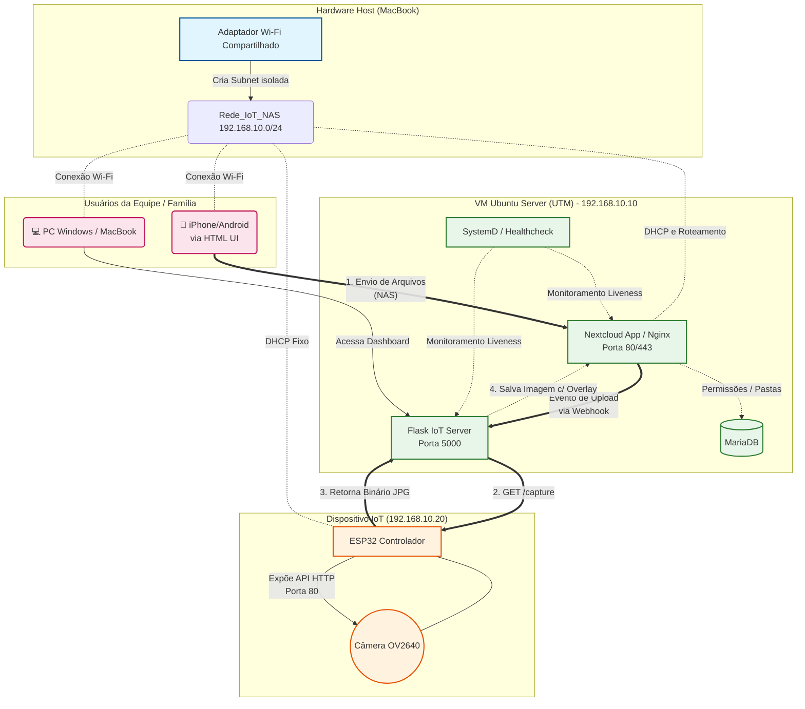

# Diagrama de Arquitetura do Sistema

O diagrama abaixo ilustra como os componentes do projeto se comunicam dentro da rede isolada gerada pelo MacBook. Todo o fluxo acontece *sem internet externa*.

### Explicação do Fluxo Crítico:
1. Um usuário sobe uma Midia no App web do Nextcloud local.
2. O sistema de Webhooks do Nextcloud dispara uma notificação PUSH em formato JSON pro nosso arquivo `server.py` escutando na porta 5000.
3. O Flask solicita ativamente que o ESP tire uma foto enviando um GET `/capture`.
4. O ESP processa, liga a câmera e devolve o byte-stream localmente pro Flask.
5. O Flask injeta Carimbos de Tempo usando o OpenCV e joga o arquivo final de volta pro Nextcloud, listando-o na interface de Dashboard visual.
